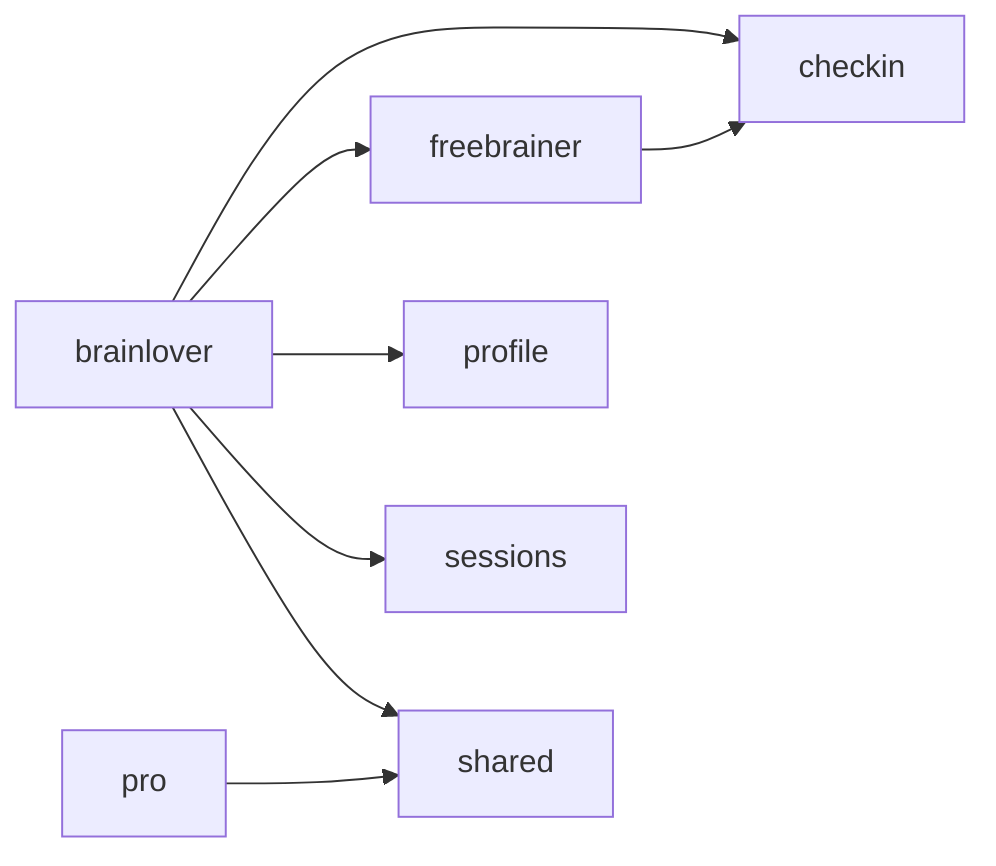

# Features & Architecture

> Auto-generated by `node scripts/generate-docs.js` — do not edit manually.
> Run `npm run docs:generate` before every release to keep this in sync.

**Last generated:** 2026-09-09

## Pages

| Route | Page | Description | Feature Dependencies |
|-------|------|-------------|----------------------|
| `/` | [Index](src/pages/Index.tsx) | Home page — slim composition layer that orchestrates all sections. | features |
| `/* (404)` | [NotFound](src/pages/NotFound.tsx) | (no JSDoc — add a /** comment at the top of this file) | — |
| `/admin-controls` | [AdminControls](src/pages/AdminControls.tsx) | Clear all caches (localStorage + service worker + browser cache) and hard-reload. | features |
| `/auth` | [Auth](src/pages/Auth.tsx) | (no JSDoc — add a /** comment at the top of this file) | — |
| `/brainloverupdates` | [BrainLoverUpdates](src/pages/BrainLoverUpdates.tsx) | BrainLoverUpdates — the BrainLover's "Updates" page with two tabs: Tab 1: "Log"     — chronological timeline of FreeBrainer activity + support Tab 2: "Results"  — insights chart, ratio, leaderboard, team roster Route: /updates (nav label: "Updates") Nav: BrainLover role only This is a slim composition layer — all sections live in src/features/brainlover/. | features |
| `/caregiver` | [BrainLoverDashboard](src/pages/BrainLoverDashboard.tsx) | BrainLoverDashboard — slim composition layer for the BrainLover's simplified dashboard. Layout (top to bottom): 1. Install banner (PWA) 2. FreeBrainerSelector (only if multiple) 3. SOS alert (only if active) 4. CompactProgressRow (streak / score / this month) 5. FreeBrainer status card + EncourageActions 6. Keep Moving card (only after checked in) 7. BrainLoverSupportSection 8. VirtualSessionCalendar 9. LatestAhaInsight All sections are modular and live in src/features/brainlover/. BrainLoverBase is NOT used here — it's kept intact for the Pro dashboard. | features |
| `/community` | [Community](src/pages/Community.tsx) | Community — Community Wall page (thin shell). All data fetching/mutations live in `useCommunityData`. All UI sub-components (CommunityHeader, PostCard, CreatePostModal, TeamRankAlertCard) are modular. Auto-detects team rank changes via `useTeamRankWatcher`. i18n namespace: `community` | features |
| `/join` | [JoinTeam](src/pages/JoinTeam.tsx) | (no JSDoc — add a /** comment at the top of this file) | — |
| `/onboarding` | [Onboarding](src/pages/Onboarding.tsx) | Onboarding.tsx — Slim orchestrator (~150 lines) ───────────────────────────────────────────── Manages step state + renders the appropriate step component. All Supabase write logic lives in useOnboardingSubmit. Photo upload lives in usePhotoUpload. Location search lives in useLocationSearch. Text-to-speech lives in useSpeak. Two-Tier Data Protocol: Tier 1 (sensitive): wellness params → localStorage (via useOnboardingSubmit) Tier 2 (social): profiles, roles, check-ins → Supabase (via useOnboardingSubmit) Tier 3 (derived): none at this stage | features |
| `/overview` | [Overview](src/pages/Overview.tsx) | Overview — FreeBrainer dashboard. Layout (top to bottom): 1. "My Journey" title 2. 50/50 grid: Virtual Sessions (left) | StreakRatioCard (right) 3. TabbedLeaderboardSection (streak + score cards, then Me/My Team tabs) 4. InsightsChartSection ("Aha!" chart) Modals: CheckInModal (auto-opens if not checked in), Calendly. Banners: InstallBanner, InstallSuccessBanner. Rally Team & SOS CTAs live on the Love page (/support), not here. | features |
| `/pro` | [BrainLoverProDashboard](src/pages/BrainLoverProDashboard.tsx) | (no JSDoc — add a /** comment at the top of this file) | features |
| `/profile` | [Profile](src/pages/Profile.tsx) | Profile page — role-aware shell. FreeBrainer: 3-section layout (Identity / Tracking / Preferences). BrainLover/Pro: Tabbed profile (Me / Them) via BrainLoverProfileTabs. - "Me" tab: BrainLover's own identity, language, notifications. - "Them" tab: Full edit access to their FreeBrainer's profile. | features |
| `/support` | [Support](src/pages/Support.tsx) | Love page — FreeBrainer encouragement hub. Two distinct sections: 1. "From Your BrainLovers" — cheers, pokes, video recommendations, plus an invite button to bring in more BrainLovers. 2. "From Your FreeBrainers" — team rallies and SOS alerts from teammates, linking to the Community Wall. Followed by the Daily Brain Fact card. Route: /support (nav label: "Love" with heart icon) Nav: FreeBrainer role only Video recommendations persist until the FreeBrainer completes a check-in using that video — tapping "Watch This Video" opens the check-in modal with that video pre-selected. | features |

## Feature Modules

### `brainlover` (brainlover)

**Components:**

- `ActivityLogEntry` — [src/features/brainlover/ActivityLogEntry.tsx](src/features/brainlover/ActivityLogEntry.tsx)
- `BrainLoverBase` — [src/features/brainlover/BrainLoverBase.tsx](src/features/brainlover/BrainLoverBase.tsx)
- `BrainLoverBoostCard` — [src/features/brainlover/BrainLoverBoostCard.tsx](src/features/brainlover/BrainLoverBoostCard.tsx)
- `BrainLoverCheckInModal` — [src/features/brainlover/BrainLoverCheckInModal.tsx](src/features/brainlover/BrainLoverCheckInModal.tsx)
- `BrainLoverEmptyState` — [src/features/brainlover/BrainLoverEmptyState.tsx](src/features/brainlover/BrainLoverEmptyState.tsx)
- `BrainLoverInsightsChart` — [src/features/brainlover/BrainLoverInsightsChart.tsx](src/features/brainlover/BrainLoverInsightsChart.tsx)
- `BrainLoverJointCheckInCard` — [src/features/brainlover/BrainLoverJointCheckInCard.tsx](src/features/brainlover/BrainLoverJointCheckInCard.tsx)
- `BrainLoverMeTab` — [src/features/brainlover/BrainLoverMeTab.tsx](src/features/brainlover/BrainLoverMeTab.tsx)
- `BrainLoverProfileTabs` — [src/features/brainlover/BrainLoverProfileTabs.tsx](src/features/brainlover/BrainLoverProfileTabs.tsx)
- `BrainLoverRosterExpanded` — [src/features/brainlover/BrainLoverRosterExpanded.tsx](src/features/brainlover/BrainLoverRosterExpanded.tsx)
- `BrainLoverRosterMinimized` — [src/features/brainlover/BrainLoverRosterMinimized.tsx](src/features/brainlover/BrainLoverRosterMinimized.tsx)
- `BrainLoverSOSAlert` — [src/features/brainlover/BrainLoverSOSAlert.tsx](src/features/brainlover/BrainLoverSOSAlert.tsx)
- `BrainLoverStreakRatioCard` — [src/features/brainlover/BrainLoverStreakRatioCard.tsx](src/features/brainlover/BrainLoverStreakRatioCard.tsx)
- `BrainLoverSupportSection` — [src/features/brainlover/BrainLoverSupportSection.tsx](src/features/brainlover/BrainLoverSupportSection.tsx)
- `BrainLoverTabbedLeaderboard` — [src/features/brainlover/BrainLoverTabbedLeaderboard.tsx](src/features/brainlover/BrainLoverTabbedLeaderboard.tsx)
- `BrainLoverTeamCard` — [src/features/brainlover/BrainLoverTeamCard.tsx](src/features/brainlover/BrainLoverTeamCard.tsx)
- `BrainLoverTeamSection` — [src/features/brainlover/BrainLoverTeamSection.tsx](src/features/brainlover/BrainLoverTeamSection.tsx)
- `BrainLoverThemTab` — [src/features/brainlover/BrainLoverThemTab.tsx](src/features/brainlover/BrainLoverThemTab.tsx)
- `BrainLoverVideoCard` — [src/features/brainlover/BrainLoverVideoCard.tsx](src/features/brainlover/BrainLoverVideoCard.tsx)
- `CompactProgressRow` — [src/features/brainlover/CompactProgressRow.tsx](src/features/brainlover/CompactProgressRow.tsx)
- `DailyActionsIndicator` — [src/features/brainlover/DailyActionsIndicator.tsx](src/features/brainlover/DailyActionsIndicator.tsx)
- `emptyStateFlag` — [src/features/brainlover/emptyStateFlag.tsx](src/features/brainlover/emptyStateFlag.tsx)
- `EncourageActions` — [src/features/brainlover/EncourageActions.tsx](src/features/brainlover/EncourageActions.tsx)
- `EncourageFlowModal` — [src/features/brainlover/EncourageFlowModal.tsx](src/features/brainlover/EncourageFlowModal.tsx)
- `FreeBrainerSelector` — [src/features/brainlover/FreeBrainerSelector.tsx](src/features/brainlover/FreeBrainerSelector.tsx)
- `FreeBrainerStatusCard` — [src/features/brainlover/FreeBrainerStatusCard.tsx](src/features/brainlover/FreeBrainerStatusCard.tsx)
- `LatestAhaInsight` — [src/features/brainlover/LatestAhaInsight.tsx](src/features/brainlover/LatestAhaInsight.tsx)
- `MonthlySummaryCard` — [src/features/brainlover/MonthlySummaryCard.tsx](src/features/brainlover/MonthlySummaryCard.tsx)
- `SolidarityBanner` — [src/features/brainlover/SolidarityBanner.tsx](src/features/brainlover/SolidarityBanner.tsx)
- `TimelineRenderer` — [src/features/brainlover/TimelineRenderer.tsx](src/features/brainlover/TimelineRenderer.tsx)

**Hooks:**

- `useBrainLoverData` — [src/features/brainlover/useBrainLoverData.ts](src/features/brainlover/useBrainLoverData.ts)
- `useBrainLoverLeaderboard` — [src/features/brainlover/useBrainLoverLeaderboard.ts](src/features/brainlover/useBrainLoverLeaderboard.ts)
- `useBrainLoverSOS` — [src/features/brainlover/useBrainLoverSOS.ts](src/features/brainlover/useBrainLoverSOS.ts)
- `useBrainLoverSupportBadge` — [src/features/brainlover/useBrainLoverSupportBadge.ts](src/features/brainlover/useBrainLoverSupportBadge.ts)
- `useBrainLoverUpdates` — [src/features/brainlover/useBrainLoverUpdates.ts](src/features/brainlover/useBrainLoverUpdates.ts)
- `useFreeBrainerProfile` — [src/features/brainlover/useFreeBrainerProfile.ts](src/features/brainlover/useFreeBrainerProfile.ts)

**Other files:**

- `types.ts` — [src/features/brainlover/types.ts](src/features/brainlover/types.ts)

**Cross-feature dependencies:** `checkin`, `freebrainer`, `profile`, `sessions`, `shared`

### `checkin` (shared (check-in flow))

**Components:**

- `ActivityLogInput` — [src/features/checkin/ActivityLogInput.tsx](src/features/checkin/ActivityLogInput.tsx)
- `BrainLoverAlertsBanner` — [src/features/checkin/BrainLoverAlertsBanner.tsx](src/features/checkin/BrainLoverAlertsBanner.tsx)
- `CheckInActivityLogStep` — [src/features/checkin/CheckInActivityLogStep.tsx](src/features/checkin/CheckInActivityLogStep.tsx)
- `CheckInFlow` — [src/features/checkin/CheckInFlow.tsx](src/features/checkin/CheckInFlow.tsx)
- `CheckInModal` — [src/features/checkin/CheckInModal.tsx](src/features/checkin/CheckInModal.tsx)
- `CheckInMovementChoice` — [src/features/checkin/CheckInMovementChoice.tsx](src/features/checkin/CheckInMovementChoice.tsx)
- `CheckInReviewStep` — [src/features/checkin/CheckInReviewStep.tsx](src/features/checkin/CheckInReviewStep.tsx)
- `CheckInSymptomStep` — [src/features/checkin/CheckInSymptomStep.tsx](src/features/checkin/CheckInSymptomStep.tsx)
- `CheckInTimeStep` — [src/features/checkin/CheckInTimeStep.tsx](src/features/checkin/CheckInTimeStep.tsx)
- `CheckInVideoStep` — [src/features/checkin/CheckInVideoStep.tsx](src/features/checkin/CheckInVideoStep.tsx)
- `KeepMovingCard` — [src/features/checkin/KeepMovingCard.tsx](src/features/checkin/KeepMovingCard.tsx)
- `MysteryBoxReward` — [src/features/checkin/MysteryBoxReward.tsx](src/features/checkin/MysteryBoxReward.tsx)
- `RallyTeamModal` — [src/features/checkin/RallyTeamModal.tsx](src/features/checkin/RallyTeamModal.tsx)

**Hooks:**

- `useCheckInData` — [src/features/checkin/useCheckInData.ts](src/features/checkin/useCheckInData.ts)

**Cross-feature dependencies:** none

### `community` (shared (community))

**Hooks:**

- `useCommunityData` — [src/features/community/useCommunityData.ts](src/features/community/useCommunityData.ts)
- `useLinkedFreeBrainers` — [src/features/community/useLinkedFreeBrainers.ts](src/features/community/useLinkedFreeBrainers.ts)
- `useTeamRankWatcher` — [src/features/community/useTeamRankWatcher.ts](src/features/community/useTeamRankWatcher.ts)

**Cross-feature dependencies:** none

### `freebrainer` (freebrainer)

**Components:**

- `BrainLoverLoveSection` — [src/features/freebrainer/BrainLoverLoveSection.tsx](src/features/freebrainer/BrainLoverLoveSection.tsx)
- `BulkRecommendModal` — [src/features/freebrainer/BulkRecommendModal.tsx](src/features/freebrainer/BulkRecommendModal.tsx)
- `DailyBrainFactSection` — [src/features/freebrainer/DailyBrainFactSection.tsx](src/features/freebrainer/DailyBrainFactSection.tsx)
- `FreeBrainerLoveSection` — [src/features/freebrainer/FreeBrainerLoveSection.tsx](src/features/freebrainer/FreeBrainerLoveSection.tsx)
- `InsightsChartSection` — [src/features/freebrainer/InsightsChartSection.tsx](src/features/freebrainer/InsightsChartSection.tsx)
- `LeaderboardSection` — [src/features/freebrainer/LeaderboardSection.tsx](src/features/freebrainer/LeaderboardSection.tsx)
- `LeaveTeamButton` — [src/features/freebrainer/LeaveTeamButton.tsx](src/features/freebrainer/LeaveTeamButton.tsx)
- `RankRow` — [src/features/freebrainer/RankRow.tsx](src/features/freebrainer/RankRow.tsx)
- `RosterRow` — [src/features/freebrainer/RosterRow.tsx](src/features/freebrainer/RosterRow.tsx)
- `StreakRatioCard` — [src/features/freebrainer/StreakRatioCard.tsx](src/features/freebrainer/StreakRatioCard.tsx)
- `TabbedLeaderboardSection` — [src/features/freebrainer/TabbedLeaderboardSection.tsx](src/features/freebrainer/TabbedLeaderboardSection.tsx)
- `TeamSection` — [src/features/freebrainer/TeamSection.tsx](src/features/freebrainer/TeamSection.tsx)

**Hooks:**

- `useConnectedBrainLovers` — [src/features/freebrainer/useConnectedBrainLovers.ts](src/features/freebrainer/useConnectedBrainLovers.ts)
- `useLeaderboardData` — [src/features/freebrainer/useLeaderboardData.ts](src/features/freebrainer/useLeaderboardData.ts)
- `useLoveInteractions` — [src/features/freebrainer/useLoveInteractions.ts](src/features/freebrainer/useLoveInteractions.ts)
- `useOverviewData` — [src/features/freebrainer/useOverviewData.ts](src/features/freebrainer/useOverviewData.ts)
- `useTeamProfile` — [src/features/freebrainer/useTeamProfile.ts](src/features/freebrainer/useTeamProfile.ts)
- `useTeamRoster` — [src/features/freebrainer/useTeamRoster.ts](src/features/freebrainer/useTeamRoster.ts)

**Cross-feature dependencies:** `checkin`

### `home` (shared)

**Components:**

- `BecomeFreeBrainerSection` — [src/features/home/BecomeFreeBrainerSection.tsx](src/features/home/BecomeFreeBrainerSection.tsx)
- `ConditionsMarquee` — [src/features/home/ConditionsMarquee.tsx](src/features/home/ConditionsMarquee.tsx)
- `GetInvolvedSection` — [src/features/home/GetInvolvedSection.tsx](src/features/home/GetInvolvedSection.tsx)
- `HeroSection` — [src/features/home/HeroSection.tsx](src/features/home/HeroSection.tsx)
- `NeuralPathways` — [src/features/home/NeuralPathways.tsx](src/features/home/NeuralPathways.tsx)
- `OnDemandTherapySection` — [src/features/home/OnDemandTherapySection.tsx](src/features/home/OnDemandTherapySection.tsx)
- `SocialFeedCard` — [src/features/home/SocialFeedCard.tsx](src/features/home/SocialFeedCard.tsx)
- `SocialFeedsSection` — [src/features/home/SocialFeedsSection.tsx](src/features/home/SocialFeedsSection.tsx)
- `SupportingEvidenceSection` — [src/features/home/SupportingEvidenceSection.tsx](src/features/home/SupportingEvidenceSection.tsx)

**Cross-feature dependencies:** none

### `onboarding` (shared (onboarding))

**Hooks:**

- `useLocationSearch` — [src/features/onboarding/useLocationSearch.ts](src/features/onboarding/useLocationSearch.ts)
- `useOnboardingSubmit` — [src/features/onboarding/useOnboardingSubmit.ts](src/features/onboarding/useOnboardingSubmit.ts)
- `usePhotoUpload` — [src/features/onboarding/usePhotoUpload.ts](src/features/onboarding/usePhotoUpload.ts)
- `useSpeak` — [src/features/onboarding/useSpeak.ts](src/features/onboarding/useSpeak.ts)

**Cross-feature dependencies:** none

### `pro` (pro)

**Components:**

- `ProBulkInvitePanel` — [src/features/pro/ProBulkInvitePanel.tsx](src/features/pro/ProBulkInvitePanel.tsx)
- `ProFacilityOverview` — [src/features/pro/ProFacilityOverview.tsx](src/features/pro/ProFacilityOverview.tsx)
- `ProFreeBrainerDetailDrawer` — [src/features/pro/ProFreeBrainerDetailDrawer.tsx](src/features/pro/ProFreeBrainerDetailDrawer.tsx)
- `ProRosterTable` — [src/features/pro/ProRosterTable.tsx](src/features/pro/ProRosterTable.tsx)
- `ProSubAccountManager` — [src/features/pro/ProSubAccountManager.tsx](src/features/pro/ProSubAccountManager.tsx)

**Hooks:**

- `useProRosterData` — [src/features/pro/useProRosterData.ts](src/features/pro/useProRosterData.ts)

**Cross-feature dependencies:** `shared`

### `profile` (shared (profile))

**Components:**

- `SessionTestPanel` — [src/features/profile/SessionTestPanel.tsx](src/features/profile/SessionTestPanel.tsx)

**Hooks:**

- `useProfileData` — [src/features/profile/useProfileData.ts](src/features/profile/useProfileData.ts)

**Cross-feature dependencies:** none

### `sessions` (shared (sessions))

**Hooks:**

- `useVirtualSessions` — [src/features/sessions/useVirtualSessions.ts](src/features/sessions/useVirtualSessions.ts)

**Cross-feature dependencies:** none

### `shared` (shared)

**Components:**

- `BulkInviteFreeBrainerModal` — [src/features/shared/BulkInviteFreeBrainerModal.tsx](src/features/shared/BulkInviteFreeBrainerModal.tsx)
- `InviteFreeBrainerModal` — [src/features/shared/InviteFreeBrainerModal.tsx](src/features/shared/InviteFreeBrainerModal.tsx)
- `ManagedSubAccountModal` — [src/features/shared/ManagedSubAccountModal.tsx](src/features/shared/ManagedSubAccountModal.tsx)

**Hooks:**

- `useBulkInvite` — [src/features/shared/useBulkInvite.ts](src/features/shared/useBulkInvite.ts)
- `useSubAccountCreate` — [src/features/shared/useSubAccountCreate.ts](src/features/shared/useSubAccountCreate.ts)

**Cross-feature dependencies:** none

## Dependency Graph

