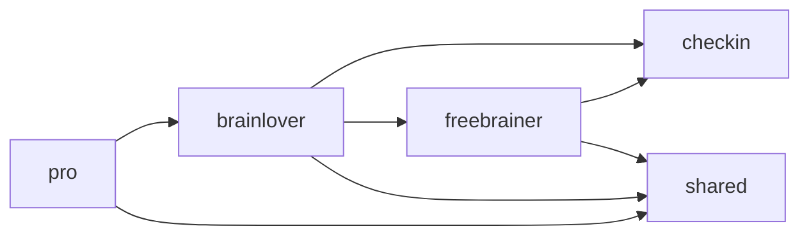

# Features & Architecture

> Auto-generated by `node scripts/generate-docs.js` — do not edit manually.
> Run `npm run docs:generate` before every release to keep this in sync.

**Last generated:** 2026-08-12

## Pages

| Route | Page | Description | Feature Dependencies |
|-------|------|-------------|----------------------|
| `/` | [Index](src/pages/Index.tsx) | (no JSDoc — add a /** comment at the top of this file) | — |
| `/* (404)` | [NotFound](src/pages/NotFound.tsx) | (no JSDoc — add a /** comment at the top of this file) | — |
| `/admin-controls` | [AdminControls](src/pages/AdminControls.tsx) | (no JSDoc — add a /** comment at the top of this file) | — |
| `/auth` | [Auth](src/pages/Auth.tsx) | (no JSDoc — add a /** comment at the top of this file) | — |
| `/caregiver` | [BrainLoverDashboard](src/pages/BrainLoverDashboard.tsx) | (no JSDoc — add a /** comment at the top of this file) | brainlover |
| `/community` | [Community](src/pages/Community.tsx) | (no JSDoc — add a /** comment at the top of this file) | community |
| `/join` | [JoinTeam](src/pages/JoinTeam.tsx) | (no JSDoc — add a /** comment at the top of this file) | — |
| `/love-their-brain` | [LoveTheirBrain](src/pages/LoveTheirBrain.tsx) | (no JSDoc — add a /** comment at the top of this file) | brainlover |
| `/onboarding` | [Onboarding](src/pages/Onboarding.tsx) | (no JSDoc — add a /** comment at the top of this file) | onboarding |
| `/overview` | [Overview](src/pages/Overview.tsx) | (no JSDoc — add a /** comment at the top of this file) | freebrainer, checkin |
| `/profile` | [Profile](src/pages/Profile.tsx) | (no JSDoc — add a /** comment at the top of this file) | profile, brainlover |
| `/pro` | [BrainLoverProDashboard](src/pages/BrainLoverProDashboard.tsx) | (no JSDoc — add a /** comment at the top of this file) | brainlover, pro |
| `/support` | [Support](src/pages/Support.tsx) | (no JSDoc — add a /** comment at the top of this file) | freebrainer |

## Feature Modules

### `brainlover` (brainlover)

**Components:**

- `BrainLoverBase` — [src/features/brainlover/BrainLoverBase.tsx](src/features/brainlover/BrainLoverBase.tsx)
- `BrainLoverBoostCard` — [src/features/brainlover/BrainLoverBoostCard.tsx](src/features/brainlover/BrainLoverBoostCard.tsx)
- `BrainLoverInsightsChart` — [src/features/brainlover/BrainLoverInsightsChart.tsx](src/features/brainlover/BrainLoverInsightsChart.tsx)
- `BrainLoverJointCheckInCard` — [src/features/brainlover/BrainLoverJointCheckInCard.tsx](src/features/brainlover/BrainLoverJointCheckInCard.tsx)
- `BrainLoverMeTab` — [src/features/brainlover/BrainLoverMeTab.tsx](src/features/brainlover/BrainLoverMeTab.tsx)
- `BrainLoverProfileTabs` — [src/features/brainlover/BrainLoverProfileTabs.tsx](src/features/brainlover/BrainLoverProfileTabs.tsx)
- `BrainLoverSOSAlert` — [src/features/brainlover/BrainLoverSOSAlert.tsx](src/features/brainlover/BrainLoverSOSAlert.tsx)
- `BrainLoverStreakRatioCard` — [src/features/brainlover/BrainLoverStreakRatioCard.tsx](src/features/brainlover/BrainLoverStreakRatioCard.tsx)
- `BrainLoverTabbedLeaderboard` — [src/features/brainlover/BrainLoverTabbedLeaderboard.tsx](src/features/brainlover/BrainLoverTabbedLeaderboard.tsx)
- `BrainLoverThemTab` — [src/features/brainlover/BrainLoverThemTab.tsx](src/features/brainlover/BrainLoverThemTab.tsx)
- `BrainLoverVideoCard` — [src/features/brainlover/BrainLoverVideoCard.tsx](src/features/brainlover/BrainLoverVideoCard.tsx)
- `DailyActionsIndicator` — [src/features/brainlover/DailyActionsIndicator.tsx](src/features/brainlover/DailyActionsIndicator.tsx)
- `EncourageActions` — [src/features/brainlover/EncourageActions.tsx](src/features/brainlover/EncourageActions.tsx)
- `EncourageFlowModal` — [src/features/brainlover/EncourageFlowModal.tsx](src/features/brainlover/EncourageFlowModal.tsx)
- `FreeBrainerSelector` — [src/features/brainlover/FreeBrainerSelector.tsx](src/features/brainlover/FreeBrainerSelector.tsx)
- `FreeBrainerStatusCard` — [src/features/brainlover/FreeBrainerStatusCard.tsx](src/features/brainlover/FreeBrainerStatusCard.tsx)

**Hooks:**

- `useBrainLoverData` — [src/features/brainlover/useBrainLoverData.ts](src/features/brainlover/useBrainLoverData.ts)
- `useBrainLoverLeaderboard` — [src/features/brainlover/useBrainLoverLeaderboard.ts](src/features/brainlover/useBrainLoverLeaderboard.ts)
- `useBrainLoverSOS` — [src/features/brainlover/useBrainLoverSOS.ts](src/features/brainlover/useBrainLoverSOS.ts)
- `useFreeBrainerProfile` — [src/features/brainlover/useFreeBrainerProfile.ts](src/features/brainlover/useFreeBrainerProfile.ts)

**Other files:**

- `types.ts` — [src/features/brainlover/types.ts](src/features/brainlover/types.ts)

**Cross-feature dependencies:** `checkin`, `freebrainer`, `shared`

### `checkin` (shared (check-in flow))

**Components:**

- `BrainLoverAlertsBanner` — [src/features/checkin/BrainLoverAlertsBanner.tsx](src/features/checkin/BrainLoverAlertsBanner.tsx)
- `CheckInFlow` — [src/features/checkin/CheckInFlow.tsx](src/features/checkin/CheckInFlow.tsx)
- `CheckInModal` — [src/features/checkin/CheckInModal.tsx](src/features/checkin/CheckInModal.tsx)
- `CheckInMovementChoice` — [src/features/checkin/CheckInMovementChoice.tsx](src/features/checkin/CheckInMovementChoice.tsx)
- `CheckInReviewStep` — [src/features/checkin/CheckInReviewStep.tsx](src/features/checkin/CheckInReviewStep.tsx)
- `CheckInSymptomStep` — [src/features/checkin/CheckInSymptomStep.tsx](src/features/checkin/CheckInSymptomStep.tsx)
- `CheckInTimeStep` — [src/features/checkin/CheckInTimeStep.tsx](src/features/checkin/CheckInTimeStep.tsx)
- `CheckInVideoStep` — [src/features/checkin/CheckInVideoStep.tsx](src/features/checkin/CheckInVideoStep.tsx)
- `KeepMovingCard` — [src/features/checkin/KeepMovingCard.tsx](src/features/checkin/KeepMovingCard.tsx)
- `MysteryBoxReward` — [src/features/checkin/MysteryBoxReward.tsx](src/features/checkin/MysteryBoxReward.tsx)
- `RallyTeamModal` — [src/features/checkin/RallyTeamModal.tsx](src/features/checkin/RallyTeamModal.tsx)

**Hooks:**

- `useCheckInData` — [src/features/checkin/useCheckInData.ts](src/features/checkin/useCheckInData.ts)

**Cross-feature dependencies:** none

### `community` (shared (community))

**Hooks:**

- `useCommunityData` — [src/features/community/useCommunityData.ts](src/features/community/useCommunityData.ts)
- `useLinkedFreeBrainers` — [src/features/community/useLinkedFreeBrainers.ts](src/features/community/useLinkedFreeBrainers.ts)
- `useTeamRankWatcher` — [src/features/community/useTeamRankWatcher.ts](src/features/community/useTeamRankWatcher.ts)

**Cross-feature dependencies:** none

### `freebrainer` (freebrainer)

**Components:**

- `BrainLoverLoveSection` — [src/features/freebrainer/BrainLoverLoveSection.tsx](src/features/freebrainer/BrainLoverLoveSection.tsx)
- `DailyBrainFactSection` — [src/features/freebrainer/DailyBrainFactSection.tsx](src/features/freebrainer/DailyBrainFactSection.tsx)
- `FreeBrainerLoveSection` — [src/features/freebrainer/FreeBrainerLoveSection.tsx](src/features/freebrainer/FreeBrainerLoveSection.tsx)
- `InsightsChartSection` — [src/features/freebrainer/InsightsChartSection.tsx](src/features/freebrainer/InsightsChartSection.tsx)
- `LeaderboardSection` — [src/features/freebrainer/LeaderboardSection.tsx](src/features/freebrainer/LeaderboardSection.tsx)
- `StreakRatioCard` — [src/features/freebrainer/StreakRatioCard.tsx](src/features/freebrainer/StreakRatioCard.tsx)
- `TabbedLeaderboardSection` — [src/features/freebrainer/TabbedLeaderboardSection.tsx](src/features/freebrainer/TabbedLeaderboardSection.tsx)
- `TeamRosterCard` — [src/features/freebrainer/TeamRosterCard.tsx](src/features/freebrainer/TeamRosterCard.tsx)
- `TeamSection` — [src/features/freebrainer/TeamSection.tsx](src/features/freebrainer/TeamSection.tsx)

**Hooks:**

- `useConnectedBrainLovers` — [src/features/freebrainer/useConnectedBrainLovers.ts](src/features/freebrainer/useConnectedBrainLovers.ts)
- `useLeaderboardData` — [src/features/freebrainer/useLeaderboardData.ts](src/features/freebrainer/useLeaderboardData.ts)
- `useLoveInteractions` — [src/features/freebrainer/useLoveInteractions.ts](src/features/freebrainer/useLoveInteractions.ts)
- `useOverviewData` — [src/features/freebrainer/useOverviewData.ts](src/features/freebrainer/useOverviewData.ts)
- `useTeamProfile` — [src/features/freebrainer/useTeamProfile.ts](src/features/freebrainer/useTeamProfile.ts)
- `useTeamRoster` — [src/features/freebrainer/useTeamRoster.ts](src/features/freebrainer/useTeamRoster.ts)

**Cross-feature dependencies:** `checkin`, `shared`

### `onboarding` (shared (onboarding))

**Hooks:**

- `useLocationSearch` — [src/features/onboarding/useLocationSearch.ts](src/features/onboarding/useLocationSearch.ts)
- `useOnboardingSubmit` — [src/features/onboarding/useOnboardingSubmit.ts](src/features/onboarding/useOnboardingSubmit.ts)
- `usePhotoUpload` — [src/features/onboarding/usePhotoUpload.ts](src/features/onboarding/usePhotoUpload.ts)
- `useSpeak` — [src/features/onboarding/useSpeak.ts](src/features/onboarding/useSpeak.ts)

**Cross-feature dependencies:** none

### `profile` (shared (profile))

**Components:**

- `SessionTestPanel` — [src/features/profile/SessionTestPanel.tsx](src/features/profile/SessionTestPanel.tsx)

**Hooks:**

- `useProfileData` — [src/features/profile/useProfileData.ts](src/features/profile/useProfileData.ts)

**Cross-feature dependencies:** none

### `pro` (pro)

**Components:**

- `ProBulkInvitePanel` — [src/features/pro/ProBulkInvitePanel.tsx](src/features/pro/ProBulkInvitePanel.tsx)
- `ProFacilityOverview` — [src/features/pro/ProFacilityOverview.tsx](src/features/pro/ProFacilityOverview.tsx)
- `ProFreeBrainerDetailDrawer` — [src/features/pro/ProFreeBrainerDetailDrawer.tsx](src/features/pro/ProFreeBrainerDetailDrawer.tsx)
- `ProRosterTable` — [src/features/pro/ProRosterTable.tsx](src/features/pro/ProRosterTable.tsx)
- `ProSubAccountManager` — [src/features/pro/ProSubAccountManager.tsx](src/features/pro/ProSubAccountManager.tsx)

**Hooks:**

- `useProRosterData` — [src/features/pro/useProRosterData.ts](src/features/pro/useProRosterData.ts)

**Cross-feature dependencies:** `brainlover`, `shared`

### `sessions` (shared (sessions))

**Hooks:**

- `useVirtualSessions` — [src/features/sessions/useVirtualSessions.ts](src/features/sessions/useVirtualSessions.ts)

**Cross-feature dependencies:** none

### `shared` (shared)

**Components:**

- `BulkInviteFreeBrainerModal` — [src/features/shared/BulkInviteFreeBrainerModal.tsx](src/features/shared/BulkInviteFreeBrainerModal.tsx)
- `InviteFreeBrainerModal` — [src/features/shared/InviteFreeBrainerModal.tsx](src/features/shared/InviteFreeBrainerModal.tsx)
- `ManagedSubAccountModal` — [src/features/shared/ManagedSubAccountModal.tsx](src/features/shared/ManagedSubAccountModal.tsx)

**Hooks:**

- `useBulkInvite` — [src/features/shared/useBulkInvite.ts](src/features/shared/useBulkInvite.ts)
- `useSubAccountCreate` — [src/features/shared/useSubAccountCreate.ts](src/features/shared/useSubAccountCreate.ts)

**Cross-feature dependencies:** none

## Dependency Graph

